# TITULO DEL PROYECTO   :globe_with_meridians:

# Uso de clases y objetivo:pushpin:

# PARTICIPANTES:construction_worker:

**1. Angulo Bone Jordy Jorkael**:alien:

>>En la primera parte del programa elaboré  los códigos para pedir al usuario sus datos personales ,como lla cédula,nombres y apellidos,estatura, peso y fecha de nacimiento para ello se utilizó la función "void ingresar",luego con el "cout<<" se mostró el mensaje en pantalla pidiendo el ingreso de su nombre y ahí mismo con los otros datos, y cin>> para almacenar el valor ingresado por el usuario y por último se utilizó la función "void mostrar" y  "cout<<" el  nombre de la variable para mostrar los datos en pantalla.

**2. Heredia Ruiz Emerson Joao**:alien:

>>La modificación del problema que realizó fue añadir la parte de lectura del programa y también donde se utilizó el (while) la cual ayudo a ejecutar el programa. También el uso del (getline), para que así al final se pueda realizar la lectura del programa.

**3. Edis Jipson Sosa Quiñonez**:fire:

>>Realizo el cálculo del índice corporal de una persona, pidiéndole al usuario la altura y peso de la persona, también utilizo estructuras de condición “IF” que dependiendo de la masa corporal que salga como resultado, este envía un mensaje a la persona de lo bien o mal que esta de salud sobre su cuerpo y además de eso se le envía recomendaciones a la persona para mejorar su salud.

**4. Luis Abrahan Quiñonez Caicedo**:rocket:

>>En esta parte me toco desarrollar la edad de una persona para ello tuve que declarar todas las variables necesarias sin asignarles ningún valor y dejar que el usuario ingrese sus datos personales tales como fecha actual, fecha de nacimiento. Para hacer el cálculo se utilizó la estructura del "IF" para así condicionar varios parámetros y obtener el resultado deseado.

**5. Ortiz Napa Rommel Jeremy**:globe_with_meridians:

>>Se realizó el guardado de los datos ingresados por el usuario en un archivo txt.

# COMPOSICIÓN:page_facing_up:

*Nombre de los archivos que integran el proyecto son: "PRINCIPAL" >> "MICLASE.H"*

***La clase utilizada es: ***

**CLASS PERSONA**

***Las funciones implementadas en el archivo de "MICLASE.H" fueron 6 y son: ***

**1. Void ingresar**

**2. Void mostrar**

**3. Void digitar**

**4. Void set_masa**

**5. Void save**

**6. Void lectura**

# DESCRIPCIÓN:bookmark:

**1. Void ingresar**=Esta función sirve en el programa para poder ingresar los datos personales del usuario como lo son el: el nombre, estatura, cedula, fecha de nacimiento y peso. Mediante la utilización del comando "cout>>" para mostrar el mensaje en pantalla "cin<<" para guardar el dato ingresado por el usuario y esta función se encuentra en el menú principal para poderla llamar

**2. Void mostrar**=Cumple la función de mostrar los datos ingresado por el usuario "cout>>" y esta función se encuentra en el archivo principal para poderla llamar.

**3. Void digitar**=Utilizando funciones como "void digitar" para llamar al programa desde el menú principal y luego se muestra por pantalla el texto que requiere el usuario para ingresar sus datos como "digite la fecha actual" , "digite su fecha de nacimiento" siguiendo los parámetros adecuados para que el usuario entienda en que formato se debe ingresarlos finalmente se muestra por pantalla su edad actual acompañado de meses y días todo esto con los flujos de entrada y salida  estándar como son el "cin" que normalmente es por teclado y el"cout<<" que por lo general es la pantalla.

**4. Void set_masa**=Para que la función void set_masa funcione debe ser llamada directamente desde la principal. Una vez que esta función sea llamada se presentan dos mensajes que indiquen a la persona que ingrese su peso y su estatura, luego con los datos ingresados calcula el índice de la masa corporal y guarda el resultado en la una variable llamada masa, además de eso se utilizan condiciones “IF” para comparar el resultado con otros índices de masa corporal y presentándole mensajes de lo bien o mal que esta su peso.

**5. Void save**=Este guarda los datos ingresados por el usuario en un "bloc" de nota.

**6. Void lectura**=Esta muestra en pantalla los datos guardados en el "bloc" de nota.

***Archivo Principal***

En el archivo principal es donde se encuentra todas las librerías necesarias para que el programa se ejecute de manera correcta. 

Como son:

#include<iostream>

#include<stdlib.h>

#include<string.h>

#include<malloc.h>

#include<fstream>

#include "miclase.h"

Es aquí en este archivo se encuentra todas las variables, funciones, clases y el menú de inicio donde se le muestra las opciones que tiene para que el usuario pueda elegir y cada opción tiene un "case" ejemplo "case1", "case2", "case3", etc.

# INSTALACIÓN:wrench:

Para realizar la instalación del programa se deben realizar los siguientes pasos.

# DESCARGA:white_check_mark:

1.	Dirigirse al repositorio donde está ubicado el archivo.

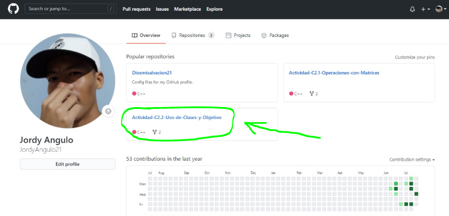

2.	Dar clic donde dice code.

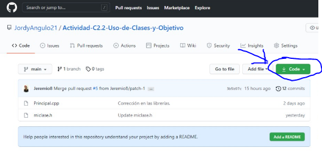

3.	Dar clic en “Download” Zip

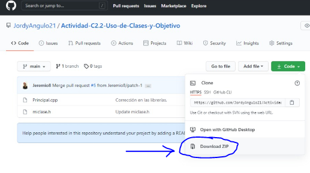

4.	Dirigirse al archivo descargado y darle clic “extraer aquí” 

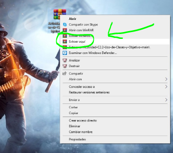

5.	Dar clic en la carpeta extraída.

6.	Como podemos ver aquí se muestran los archivos descargados.

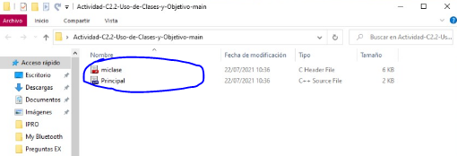

# EJECUCIÓN:hammer:

Para realizar la ejecución del programa se deben realizar los siguientes pasos.

1.	Abrir los archivos descargados dando doble clic sobre ellos.

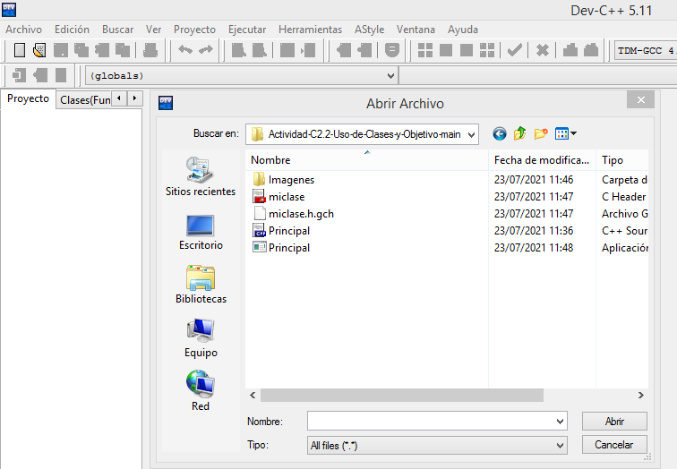

2.	Una vez abierto los archivo compilar y ejecutarlos.

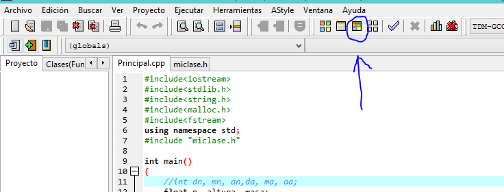

3.	Una vez ejecutado el programa se muestra el menú y elije una opción.

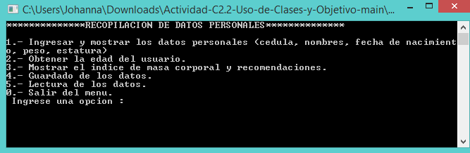

4.	En opción 1 ingresar los datos que le pide el menú. 

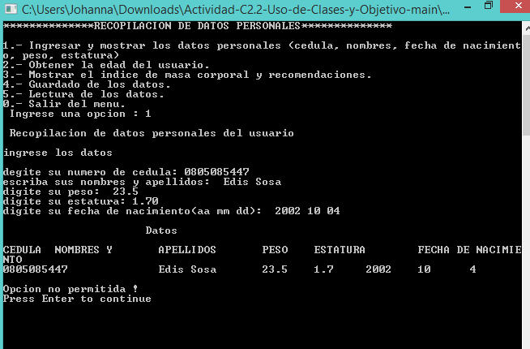

5.	En la opción 2 se pide ingresar la fecha actual y la fecha de nacimiento para calcular la edad.

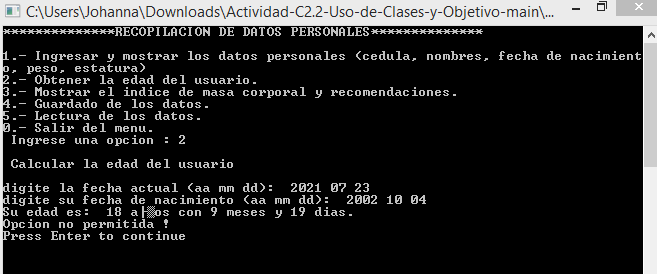

6.	En la opción 3 se pide ingresar la estatura y masa de la persona para calcular el índice de la masa corporal. Y presentar mensaje sobre su salud.

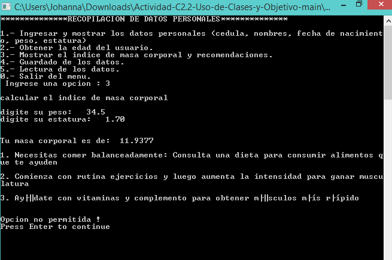

7.	En la opción 4 se guardan los datos en un archivo txt.

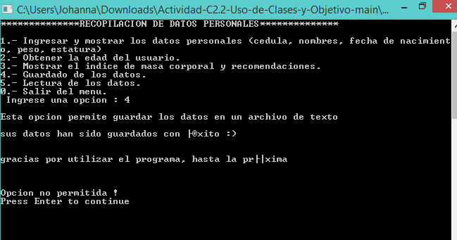

8.	En la opción 5 se muestran los datos que han sido guardado en el archivo txt.

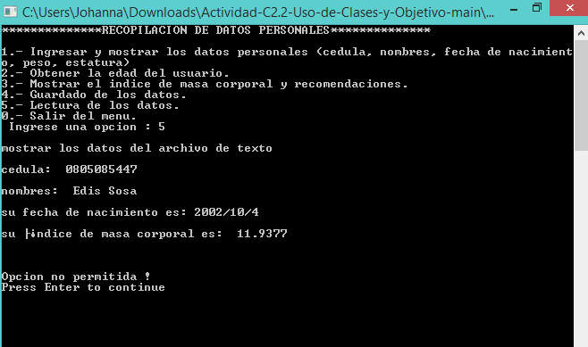

